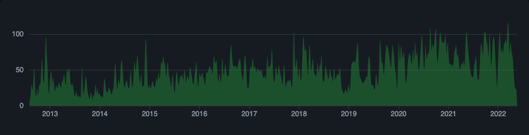

---
title: Trino - SQL on Everything!
author: Jan Waś
patat:
  images:
    backend: kitty
...

# Trino


# What is Trino

A scalable
pluggable
ANSII SQL query engine

<!--
Data virtualization - allows joining data from different sources.
Some RDBMS clients can also process and join data locally - Tableau, Grafana.
Reads and processes petabytes of csv, json, orc or parquet files from hdfs or s3 in Hive layout.
-->

# What Trino is not

an RDBMS

# ELI5

```
client <-----------------> Trino coordinator
          HTTP or JDBC             ^
                                   |
                                   | HTTP
                                   |
                                   v
                          1..n Trino workers <--------------------------> data
                                                 HDFS, S3, JDBC, other
```
<!--
Mention it runs on JVM
-->

# Run it

```bash
docker run \
  -d \
  --name trino \
  -p8080:8080 \
  trinodb/trino:381
```

# Query it

```bash
docker exec -it trino trino
pip install trino[sqlalchemy]
```
<!--
Or use DBeaver
-->

# What is an SQL engine

OLTP
OLAP

<!--
Explain what is OLTP and OLAP and trade-offs like random-access speed,
read and write amplification
-->

# Separate compute and storage

Spark
InnoDB
MyISAM
PostgreSQL FDW

<!--
Separation allows trying out different access patterns over heterogenous formats.
-->

# Storage

```
s3://my-bucket/prod-data
  |-date=2022-05-25
  |  |-customer=Fry
  |  |  |-aa.json
  |  |  \-bb.json
  |  |-customer=Leila
  |  |  |-cc.json
  |  |  \-dd.json
  |-date=2022-05-24
  |  |...
  |...
```

<!--
Mention: s3 or hdfs; supported file formats; supported layout
ORC and Parquet are mini-databases with compression and indexes!
-->

# Hive, Iceberg, Delta Lake

Table formats
File layouts
Data types
Schema evolution
Transactions

<!--
Hive is older and doesn't have a good spec.
Iceberg is new.
Delta Lake has transactions!
-->

# Hive, Iceberg, Delta Lake

Plugins for reading
a lot of files
from a network FS (HDFS or S3).

<!--
Great lakes
-->

# Metastore

```
client <-----------------> Trino coordinator <--------------> metastore
          HTTP or JDBC             ^           Thrift, Glue
                                   |
                                   | HTTP
                                   |
                                   v
                          1..n Trino workers <--------------> data
                                                 HDFS, S3
```
<!--
Hive Metastore or Glue
-->

# Example

```
connector.name=hive

hive.metastore=glue
hive.metastore.glue.region=eu-central-1

hive.s3.endpoint=s3.eu-central-1.amazonaws.com

hive.s3select-pushdown.enabled=true
hive.storage-format=ORC
```

<!--
Query time!
-->

# Scaling up

Massive Parallel Processing.

Many workers, single coordinator.

<!--
Trino splits up work and distributes across all workers.
Mention new scheduling mode for task retries.
-->

# SQL on everything

BigData: Accumulo, BigQuery, Cassandra, Delta Lake, Druid, Hive, Iceberg, Kudu, Phoenix, Pinot, Redshift, SingleStore (MemSQL)
Time series: ClickHouse, Prometheus
Document: MongoDB, Elasticsearch
Relational: MariaDB, MySQL, Oracle, PostgreSQL, SQL Server
Streaming: Kafka, Kinesis
Key-value: Redis
Other: Atop, Black Hole, Google Sheets, JMX, Local File, Memory, System, Thrift, TPCDS, TPCH

# ANSII SQL

Data types
Arrays
every `JOIN`, `LATERAL`
`WITH`, `WITH RECURSIVE`
Window functions
`GROUPING SET`, `ROLLUP`, `CUBE`
`MATCH_RECOGNIZE`
Data sketches

<!--
There is not a single DB that implements 100% of ANSII SQL.
But Trino is very close.
Most of SQL 2016, coming up: PTF, MERGE
-->

# DDL and DML

`INSERT`, `UPDATE`, `DELETE`
`CREATE TABLE AS SELECT`
`CREATE VIEW`
`ALTER TABLE`

<!--
MERGE coming soon
Most implemented by plugins
-->

# Missing

`INSERT ON CONFLICT`, `MERGE`
`UPDATE FROM`, `DELETE FROM`
`CREATE FUNCTION`
Constraints
Triggers


# Query federation

```sql
SELECT
  c.name,
  count(t.id) AS num_trx
FROM
  hive.default.transactions t
JOIN
  rds.public.customer c ON c.id = t.customer_id
```

# Challenges

```sql
SELECT
  c.name,
  sum(o.value) AS total_value
FROM
  rds.public.customer c
LEFT JOIN
  rds.public.orders o ON c.id = o.customer_id
```
<!--
Correctness (casting, precision)
Overhead (pushdowns)
projection, predicate, aggregate, join pushdowns (examples, S3 select, parquet, rdmbs)
-->

# Pushdowns

+---------------+---------------+--------------------+
| Name          | Address       | Created at         |
+===============+===============+====================+
| John          | Some town     | 2022-03-11         |
+---------------+---------------+--------------------+
| Mary          | Other town    | 2019-12-01         |
+---------------+---------------+--------------------+
| Kate          | Some town     | 2012-05-22         |
+---------------+---------------+--------------------+

<!--
data types (precision), projection, predicate, aggregate, join pushdowns (examples, S3 select, parquet, rdmbs)
-->

# SPI

A `Plugin` with a `getConnectorFactories()`
that returns a `Connector` with:
`ConnectorMetadata`
`ConnectorRecordSetProvider`

<!--
Plugins don't implement whole SPI
-->

# My plugins

trino-git
trino-github
trino-slack
trino-twitter
trino-aws
trino-faker

<!-- demo! -->

# OSS



<!--
OSS (Apache 2.0) with support from a commercial company
A bit of history?
-->

# Project values

Correct
Secure
Long Term
Standards-based
Just works
Supported
Real world uses
Commercially friendly

<!--
https://trino.io/development/vision.html
-->

# Starburst Data

Extension, not a fork.

<!--
How (Trino founders at) Starburst Data cares about Trino - support, contribute, be neutral
-->

# Contributing

_extensive_ reviews
docs
latest Java
YAGNI
no mocks

<!--
* pros: _extensive_ reviews
* cons: _extensive_ reviews
-->

# OSSF Criticality score

https://commondatastorage.googleapis.com/ossf-criticality-score/index.html

```sql
WITH ranked AS (
  SELECT
    name,
    criticality_score,
    language,
    rank() OVER (PARTITION BY language ORDER BY criticality_score DESC) AS rank
  FROM storage.csv."/downloads/all.csv"
)
SELECT *
FROM ranked
WHERE name = 'trino' OR (language = 'Java' AND rank < 10);
```

# Java

```
     name      | criticality_score | language | rank
---------------+-------------------+----------+------
 elasticsearch | 0.87911           | Java     |    1
 flink         | 0.85698           | Java     |    2
 hadoop        | 0.84905           | Java     |    3
 spring-boot   | 0.84627           | Java     |    4
 jdk           | 0.83427           | Java     |    5
 beam          | 0.83394           | Java     |    6
 jenkins       | 0.83149           | Java     |    7
 netty         | 0.82462           | Java     |    8
 bazel         | 0.81703           | Java     |    9
 trino         | 0.64337           | Java     |  208
(10 rows)
```

# Python

```
     name     | criticality_score | language | rank
--------------+-------------------+----------+------
 ansible      | 0.92079           | Python   |    1
 salt         | 0.87762           | Python   |    2
 core         | 0.87187           | Python   |    3
 cpython      | 0.86941           | Python   |    4
 pandas       | 0.8628            | Python   |    5
 buildbot     | 0.85776           | Python   |    6
 numpy        | 0.85727           | Python   |    7
 airflow      | 0.85671           | Python   |    8
 scikit-learn | 0.85602           | Python   |    9
(9 rows)
```
